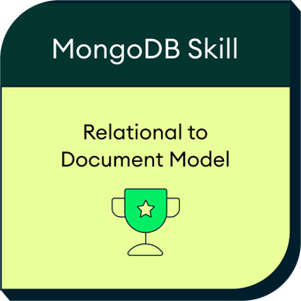
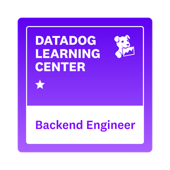

# My academic life :white_check_mark:

Reserved repository to list a little of my `academic life.`:heart_eyes:

## Index :pushpin:
- [Academic Education](#education)
- [Certification](#certification)
- [Languages](#languages)
- [Courses](#courses)

## Academic Education  :mortar_board:

- `Bachelor's degree of Computer Engineering` - State University of Maranhão _(Brazil) [website](https://www.uema.br/)._. :paperclip: [here](certificates/university-bachelor-degree.png)

## Certification  :star:

- MongoDB - From Relational Model (SQL) to MongoDBs Document Model. `MongoDB`. March/2025. :paperclip: [here](https://www.credly.com/badges/0d4592c4-3c23-4c1d-8c41-d0d1c265495e)

- Datadog - Backend Engineer Learning Path
. `Datadog`. August/2026. :paperclip: [here](https://www.credly.com/earner/earned/badge/1e1fe346-bea8-4f46-ac48-51bd45fa7ed0)

## Languages  :round_pushpin:

- **Portuguese:** Native speaker, I am Brazilian. :brazil:
- **English:** B1 (Conversational) • B2 (Reading & Writing) :us:
- **Spanish:** Basic. :es:

## Courses  :pencil2:

Below is a list of the courses I completed. There are currently `7` courses with a total of `278.5 hours.`

#### Git

- Master Git and GitHub: From Beginner to Expert. _School: [Udemy](https://www.udemy.com)._ _Duration: 4h._ :paperclip: [here](https://www.udemy.com/certificate/UC-f30dd502-fddd-4b59-abb1-2b19fc4a6cdf/)

#### Java

- Complete Java: From Beginner to Professional + Projects. _School: [Udemy](https://www.udemy.com)._ _Duration: 77h._ :paperclip: [here](https://www.udemy.com/certificate/UC-655ecfae-d461-4598-b513-caa9bc4c9ec4/)
- Complete Java: Object-Oriented Programming (OOP) + Projects. _School: [Udemy](https://www.udemy.com)._ _Duration: 54h._ :paperclip: [here](https://www.udemy.com/certificate/UC-09760383-c109-4f1e-a3a4-4a5eaddd7385/)

#### Spring

- REST API's RESTFul do 0 à AWS c. Spring Boot Kotlin e Docker. _School: [Udemy](https://www.udemy.com)._ _Duration: 33.5h._ :paperclip: [here](https://www.udemy.com/certificate/UC-b60088a4-e303-4d84-81c6-fd620ccf5ad2/)

#### Python

- Machine Learning e Data Science com Python _School: [Udemy](https://www.udemy.com)._ _Duration: 16.5h._ :paperclip: [here](https://www.udemy.com/certificate/UC-06d64a85-3298-405e-8a04-f9ed2ee57e11/)

#### JavaScript

- Complete Modern JavaScript Web Development + Projects _School: [Udemy](https://www.udemy.com)._ _Duration: 89h._ :paperclip: [here](https://www.udemy.com/certificate/UC-23f57f6b-a769-461c-b080-d65639ecb63b/)

#### MongoDB

- Build NodeJS applications with Mongodb _School: [Udemy](https://www.udemy.com)._ _Duration: 4.5h._ :paperclip: [here](https://www.udemy.com/certificate/UC-9128c9f6-55d7-4c42-831b-52da364e2e89/)
